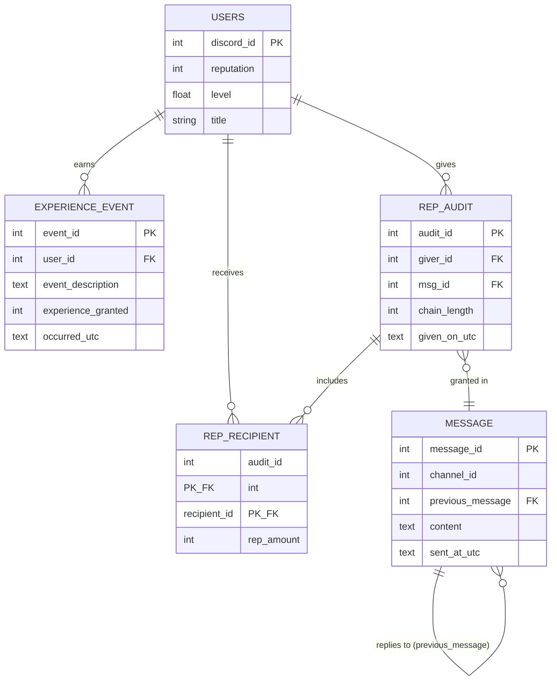

# Reputation & XP Schema

Design for issue [#10](https://github.com/Oxidize-Mail/ferrum/issues/10). This is a schema
design, not code — see `reputation-xp-open-questions.md` for what's still undecided.

## Scoping assumption

This schema assumes **one guild per running bot instance**. If someone else wants the bot,
they fork the repo and run their own instance with their own bot token/guild. There is no
`guild_id` anywhere in the schema. If multi-guild support is ever needed, `Users.discord_id`
can no longer be a standalone primary key and this design must be revisited.

## Entity-relationship diagram

## Tables

### Users
Global identity plus the current standing derived from the tables below.

| Column | Type | Notes |
|---|---|---|
| `discord_id` | INTEGER | Primary key. The Discord snowflake. |
| `reputation` | INTEGER | Running total, derived from `rep_recipient`. |
| `level` | REAL | Fractional — e.g. `3.25` means a quarter of the way from level 3 to 4. |
| `title` | TEXT | Not null. |

### repAudit
One row per rep-giving action (one giver, one message, possibly several recipients).

| Column | Type | Notes |
|---|---|---|
| `audit_id` | INTEGER | Primary key. |
| `giver_id` | INTEGER | FK → `Users.discord_id`. |
| `msg_id` | INTEGER | FK → `message.message_id`. The message the rep was granted in. |
| `chain_length` | INTEGER | Snapshot of the reply-chain length at the moment of granting (see below). Stored, not recomputed, so a later edit/delete in the chain can't change a past grant's audit trail. |
| `given_on_utc` | TEXT | ISO-8601 UTC timestamp. |

### rep_recipient
Junction table — a single grant can target multiple recipients, each with their own amount.

| Column | Type | Notes |
|---|---|---|
| `audit_id` | INTEGER | Part of composite PK. FK → `repAudit.audit_id`. |
| `recipient_id` | INTEGER | Part of composite PK. FK → `Users.discord_id`. |
| `rep_amount` | INTEGER | Rep given to this specific recipient. |

### message
Only messages that end up part of a rep-grant's reply chain are stored here — this is not a
general activity log. When a grant is made, the bot walks the reply-reference chain back from
the triggering message (via Discord's own reply data) and persists the messages in that chain,
recording `chain_length` on the `repAudit` row.

| Column | Type | Notes |
|---|---|---|
| `message_id` | INTEGER | Primary key. The Discord message snowflake. |
| `channel_id` | INTEGER | |
| `previous_message` | INTEGER | FK → `message.message_id`. The Discord reply-reference parent, not "whatever was sent before it in the channel." |
| `content` | TEXT | |
| `sent_at_utc` | TEXT | ISO-8601 UTC timestamp. |

### experience_event
Append-only log of XP-granting activity.

| Column | Type | Notes |
|---|---|---|
| `event_id` | INTEGER | Primary key. |
| `user_id` | INTEGER | FK → `Users.discord_id`. |
| `event_description` | TEXT | |
| `experience_granted` | INTEGER | Whole XP points for this event. |
| `occurred_utc` | TEXT | ISO-8601 UTC timestamp. |

## Time storage

All timestamps are `TEXT` in ISO-8601 UTC (`YYYY-MM-DDTHH:MM:SSZ`), per SQLite's own
recommendation (sortable as strings, human-readable, and usable directly with SQLite's
date/time functions). Not unix epoch integers.

## Foreign keys

SQLite has foreign keys **off by default**. The application must run
`PRAGMA foreign_keys = ON;` on every connection for the FKs above to actually be enforced.

## Indexes decided so far

| Index | Serves |
|---|---|
| `repAudit(giver_id, given_on_utc)` | Cooldown checks — "has this user given rep recently." |
| `message(previous_message)` | Walking the reply chain to compute `chain_length`. |
| `rep_recipient(recipient_id)` | Leaderboard / "total rep received" queries. |

More may be needed — see open questions.

## Read/write operations (plain English)

**Writes**
- Insert a `repAudit` row (with giver, message, chain length, timestamp) plus one `rep_recipient` row per recipient, when someone gives rep.
- Update `Users.reputation` for each recipient to reflect the new total.
- Insert an `experience_event` row, and update `Users.level`, when a user does XP-earning activity.
- Insert `message` rows for the reply chain walked at grant time (only when a grant happens).

**Reads**
- Get a user's current reputation and level (`Users` by `discord_id`).
- Get the leaderboard — top N users by `reputation` (or by `level`).
- Get a user's rep history — all `repAudit`/`rep_recipient` rows where they're giver or recipient, most recent first.
- Get a user's XP history — all `experience_event` rows for them.
- Check whether a user is inside a rep cooldown window (latest `repAudit.given_on_utc` for that giver).
- Reconstruct the message chain behind a specific rep grant, for dispute resolution.

## Abuse prevention

See `reputation-xp-open-questions.md` — none of the abuse rules (self-rep, repeat-repping the
same target, rep-trading rings, XP farming) have been decided yet.

## Sign-off

- [ ] Reviewed and agreed by Brent
- [ ] Reviewed and agreed by [other collaborator]
