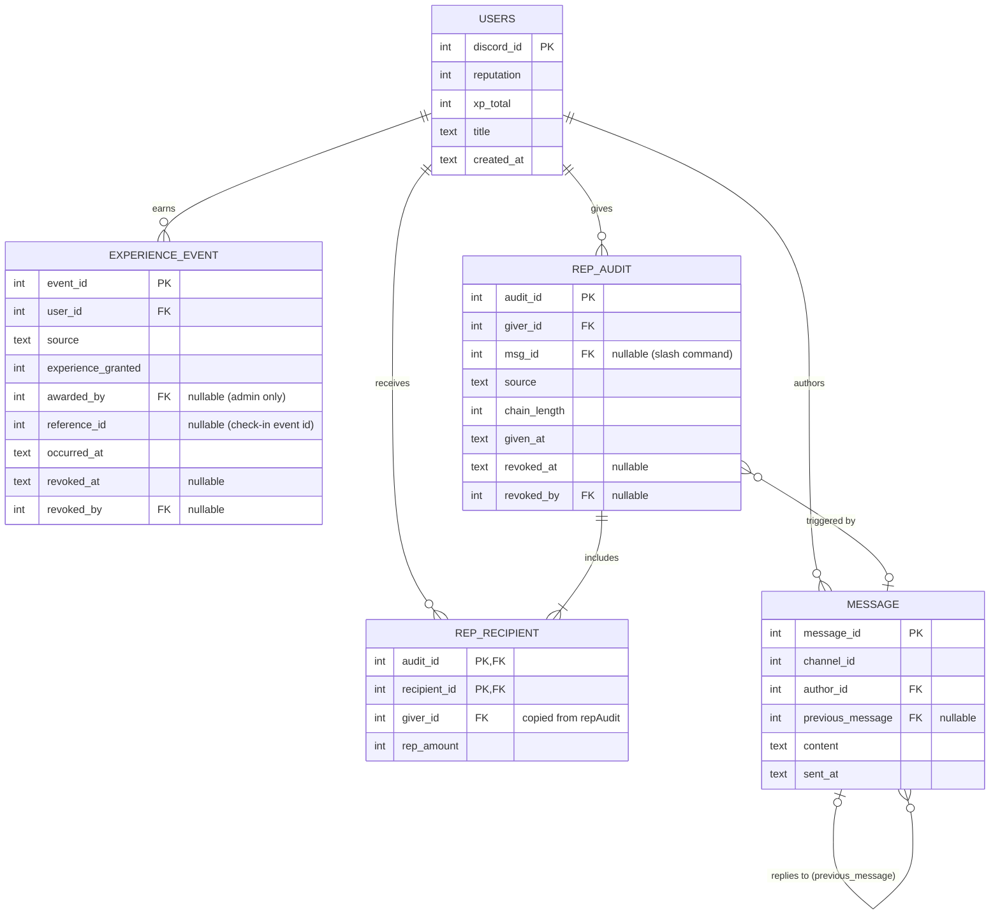

# Reputation & XP Schema

Design for issue [#10](https://github.com/Oxidize-Mail/ferrum/issues/10). This is a schema
design, not code. Everything in this doc is decided. `reputation-xp-open-questions.md` lists
what's still open; none of it changes the table structure except where noted there.

**Status:** draft, pending sign-off (see bottom).

## What the two systems measure

- **Experience (XP)** measures how *active* a member is in the server.
- **Reputation (rep)** measures how *helpful* a member is to other people.

They are tracked separately and never feed into each other.

## Scoping assumption

This schema assumes **one guild per running bot instance**. If someone else wants the bot,
they fork the repo and run their own instance with their own bot token/guild. There is no
`guild_id` anywhere in the schema. If multi-guild support is ever needed, `users.discord_id`
can no longer be a standalone primary key and this design must be revisited.

## Naming conventions

- Table names are camelCase: `users`, `repAudit`, `repRecipient`, `message`, `experienceEvent`.
- Column names are snake_case.
- Every timestamp column ends in `_at`.

Heads-up for the Postgres migration: Postgres folds unquoted identifiers to lowercase, so
`repAudit` becomes `repaudit`. This works fine as long as table names are **never quoted**
in SQL. Quoting them in one place and not another will break.

## How rep and XP are earned

**Rep** is given in one of two ways:

1. **"Thank you" message.** A message that says thank you and @-mentions one or more users.
   The bot walks the reply chain back from that message (see *Reply chains* below), and the
   length of the chain sets how much rep is granted. **Every mentioned recipient gets the full
   amount.** It is not split between them.
2. **Slash command.** A command naming the recipient and taking the rep amount as an
   argument. There is no triggering message, so `repAudit.msg_id` is `NULL` and there is no
   reply chain. The amount comes from the argument, not the chain formula.

Reactions are **not** a rep source for now. The bot can't reliably get the context of the
message being reacted to.

**XP** comes from three sources:

| Source | Amount | Notes |
|---|---|---|
| `voice` | 5 XP per minute spent in a voice channel | One `experienceEvent` row per minute. If the bot restarts, at most one minute is lost. AFK users earn nothing. |
| `admin` | Whatever the admin passes as the command argument | Admin/mod-only slash command. Positive only. |
| `weekly_checkin` | 25 XP | Awarded when a user replies to the weekly check-in event. Once per user per event. |

Ordinary text messages do **not** earn XP.

## Entity-relationship diagram


```mermaid
erDiagram
    USERS ||--o{ EXPERIENCE_EVENT : earns
    USERS ||--o{ REP_AUDIT : gives
    USERS ||--o{ REP_RECIPIENT : receives
    USERS ||--o{ MESSAGE : authors
    REP_AUDIT ||--|{ REP_RECIPIENT : includes
    REP_AUDIT }o--o| MESSAGE : "triggered by"
    MESSAGE |o--o{ MESSAGE : "replies to (previous_message)"

    USERS {
        int discord_id PK
        int reputation
        int xp_total
        text title
        text created_at
    }

    REP_AUDIT {
        int audit_id PK
        int giver_id FK
        int msg_id FK "nullable (slash command)"
        text source
        int chain_length
        text given_at
        text revoked_at "nullable"
        int revoked_by FK "nullable"
    }

    REP_RECIPIENT {
        int audit_id PK, FK
        int recipient_id PK, FK
        int giver_id FK "copied from repAudit"
        int rep_amount
    }

    MESSAGE {
        int message_id PK
        int channel_id
        int author_id FK
        int previous_message FK "nullable"
        text content
        text sent_at
    }

    EXPERIENCE_EVENT {
        int event_id PK
        int user_id FK
        text source
        int experience_granted
        int awarded_by FK "nullable (admin only)"
        int reference_id "nullable (check-in event id)"
        text occurred_at
        text revoked_at "nullable"
        int revoked_by FK "nullable"
    }
```

## Tables

### users
One row per member. Holds the running totals that are derived from the log tables below.

| Column | Type | Constraints | Notes |
|---|---|---|---|
| `discord_id` | INTEGER | PRIMARY KEY | The Discord snowflake. |
| `reputation` | INTEGER | NOT NULL DEFAULT 0 | Running total. Derived from non-revoked `repRecipient` rows. |
| `xp_total` | INTEGER | NOT NULL DEFAULT 0 | Running total. Derived from non-revoked `experienceEvent` rows. The level is **computed from this in code**, never stored (see *Leveling curve*). |
| `title` | TEXT | NOT NULL DEFAULT `'peasant'` | |
| `created_at` | TEXT | NOT NULL | When the bot first saw this user. |

A row is normally created the first time the bot sees a message from that user. Every write
that references a user also upserts them first (see *Foreign keys*), so a user who is repped
or joins voice before ever posting still gets a row.

### repAudit
One row per rep-giving action: one giver, at most one triggering message, one or more recipients.

| Column | Type | Constraints | Notes |
|---|---|---|---|
| `audit_id` | INTEGER | PRIMARY KEY | |
| `giver_id` | INTEGER | NOT NULL, FK → `users.discord_id` | |
| `msg_id` | INTEGER | NULL, FK → `message.message_id` | The "thank you" message. `NULL` for slash-command grants. |
| `source` | TEXT | NOT NULL, CHECK in (`'thanks_message'`, `'slash_command'`) | |
| `chain_length` | INTEGER | NOT NULL, CHECK between 0 and 10 | Snapshot of the reply-chain length when the rep was granted. `0` for slash commands. Stored, not recomputed, so a later edit or delete in the chain can't change a past grant's audit trail. |
| `given_at` | TEXT | NOT NULL | |
| `revoked_at` | TEXT | NULL | Set when an admin/mod revokes the grant. |
| `revoked_by` | INTEGER | NULL, FK → `users.discord_id` | The admin/mod who revoked it. |

Table-level constraints:

- `UNIQUE (giver_id, msg_id)`: one grant per giver per message. SQLite treats NULLs as
  distinct, so this doesn't restrict slash-command grants (their `msg_id` is `NULL`).
- `UNIQUE (audit_id, giver_id)`: redundant as a uniqueness rule, since `audit_id` is already
  the PK. It exists only because SQLite requires the target of `repRecipient`'s composite FK
  to have a matching unique index.
- `CHECK ((revoked_at IS NULL) = (revoked_by IS NULL))`: both are set, or neither is.

### repRecipient
Junction table. A single grant can go to several recipients. Each recipient of a
thank-you grant gets the same full amount, but the amount is stored on every row so each
recipient's history can be read on its own.

| Column | Type | Constraints | Notes |
|---|---|---|---|
| `audit_id` | INTEGER | NOT NULL | Part of the composite PK. |
| `recipient_id` | INTEGER | NOT NULL, FK → `users.discord_id` | Part of the composite PK. |
| `giver_id` | INTEGER | NOT NULL | Copied from `repAudit.giver_id`, so the pair cooldown can be answered from one index. |
| `rep_amount` | INTEGER | NOT NULL, CHECK (`rep_amount > 0`) | |

Table-level constraints:

- `PRIMARY KEY (audit_id, recipient_id)`
- `FOREIGN KEY (audit_id, giver_id) REFERENCES repAudit (audit_id, giver_id)`. This composite
  FK guarantees the copied `giver_id` always matches the grant it belongs to, so the copy
  can't drift.

### message
Only messages that are part of a rep grant's reply chain (including the thank-you message
itself) are stored here. This is not a general activity log. The full content is kept for
dispute resolution. How long it's kept is an open question.

| Column | Type | Constraints | Notes |
|---|---|---|---|
| `message_id` | INTEGER | PRIMARY KEY | The Discord message snowflake. |
| `channel_id` | INTEGER | NOT NULL | |
| `author_id` | INTEGER | NOT NULL, FK → `users.discord_id` | Who wrote it. Needed to see who actually helped whom in a dispute. |
| `previous_message` | INTEGER | NULL, FK → `message.message_id` | The Discord reply-reference parent, not "whatever was sent before it in the channel." `NULL` for the oldest message stored in a chain. |
| `content` | TEXT | NOT NULL | Full message text. |
| `sent_at` | TEXT | NOT NULL | |

### experienceEvent
Append-only log of XP-granting activity.

| Column | Type | Constraints | Notes |
|---|---|---|---|
| `event_id` | INTEGER | PRIMARY KEY | |
| `user_id` | INTEGER | NOT NULL, FK → `users.discord_id` | Who earned the XP. |
| `source` | TEXT | NOT NULL, CHECK in (`'voice'`, `'admin'`, `'weekly_checkin'`) | |
| `experience_granted` | INTEGER | NOT NULL, CHECK (`experience_granted > 0`) | Whole XP points. |
| `awarded_by` | INTEGER | NULL, FK → `users.discord_id` | The admin who awarded it. Set only when `source = 'admin'`. |
| `reference_id` | INTEGER | NULL | For `weekly_checkin`: the Discord ID of that week's check-in event message. |
| `occurred_at` | TEXT | NOT NULL | |
| `revoked_at` | TEXT | NULL | Set when an admin/mod revokes this XP award. |
| `revoked_by` | INTEGER | NULL, FK → `users.discord_id` | The admin/mod who revoked it. |

Table-level constraints:

- `CHECK ((source = 'admin') = (awarded_by IS NOT NULL))`
- `CHECK ((source = 'weekly_checkin') = (reference_id IS NOT NULL))`
- `CHECK ((revoked_at IS NULL) = (revoked_by IS NULL))`

**Volume.** Voice XP writes one row per user per minute. For example, 20 members averaging
3 h/day in voice is about 3,600 rows/day, or roughly 110k rows/month. SQLite handles
millions of rows with these indexes without trouble. See the open questions for the
archival/compaction discussion.

## Reply chains

When a "thank you" message is posted, the bot:

1. Follows Discord's reply references back from the thank-you message, **at most 10 messages**.
2. Stops early if a message in the chain has been deleted on Discord. The oldest message it
   could fetch becomes the start of the stored chain, with `previous_message = NULL`.
3. Inserts the messages **oldest first**, ending with the thank-you message itself (which
   `repAudit.msg_id` references), so each row's parent already exists when the FK is checked.
   It uses `INSERT OR IGNORE`, because a message can belong to several grants' chains.
4. Records the number of messages walked as `repAudit.chain_length`.

To reconstruct a grant's chain later, start at `repAudit.msg_id` and follow `previous_message`
up the tree. Each step is a primary-key lookup on `message_id`.

## Formulas

### Rep amount (diminishing returns on chain length)

For a chain of `n` messages (`n = chain_length`, 1 ≤ n ≤ 10):

```
rep_amount = Σ (x = 0 .. n−1) of 10 × 0.98^x
```

| n | 1 | 2 | 3 | 5 | 10 |
|---|---|---|---|---|---|
| rep (before rounding) | 10.0 | 19.8 | 29.4 | 48.0 | 91.5 |

This applies to thank-you grants only. Slash-command grants use the amount the giver passes
as an argument. Every recipient of a grant gets the full amount. `rep_amount` is an INTEGER,
so the rounding rule still needs to be picked (see open questions).

### Leveling curve

Everyone starts at **level 1** with 0 XP. Base XP is 10, with a growth factor of 1.2 per
level. The XP needed to go from level `L` to `L + 1`:

```
xp_for_next_level(L) = 10 × 1.2^L        (so level 1 → 2 costs 12 XP)
```

So the total XP needed to *reach* level `L` is:

```
xp_to_reach(L) = Σ (k = 1 .. L−1) of 10 × 1.2^k  =  50 × (1.2^L − 1.2)
```

The closed form for the inverse is `level = floor( log(xp_total / 50 + 1.2) / log(1.2) )`.
**Don't use it in code.** At an exact threshold (e.g. `xp_total = 12`), floating-point error
can produce `1.9999999`, and `floor` then gives the wrong level. Instead, start at level 1
and loop, subtracting `xp_for_next_level` until what's left is less than the next cost. The
loop runs at most a few dozen times.

For scale, at the voice rate of 5 XP/minute:

| Level | Total XP | Voice time |
|---|---|---|
| 10 | ~250 | ~50 min |
| 20 | ~1,860 | ~6 h |
| 30 | ~11,810 | ~39 h |
| 50 | ~455,000 | ~1,500 h |

## Time storage

All timestamps are `TEXT` in the ISO-8601 UTC format `YYYY-MM-DDTHH:MM:SSZ`, chosen because
the values stay human-readable when you inspect the database. SQLite itself doesn't prefer any
one format: its date functions accept TEXT, REAL (Julian day) and INTEGER (Unix epoch).

**The rule this choice imposes:** SQLite's `datetime()` returns `YYYY-MM-DD HH:MM:SS`, with a
space and no `Z`. Stored values are compared as plain text, so comparing one against
`datetime(...)` output gives wrong answers. Every comparison value must be produced in the
same format:

```sql
-- correct
WHERE given_at > strftime('%Y-%m-%dT%H:%M:%SZ', 'now', '-1 hour')
-- WRONG: 'T' sorts after ' ', so any timestamp from today counts as "later"
WHERE given_at > datetime('now', '-1 hour')
```

Timestamp columns default to `strftime('%Y-%m-%dT%H:%M:%SZ', 'now')`, so a row inserted
without an explicit time still gets the right format.

## Foreign keys

SQLite has foreign keys **off by default**. The application must run
`PRAGMA foreign_keys = ON;` on every connection for the FKs above to actually be enforced.

Every FK that points at `users` requires the user row to exist first. Any write that
references a user (a recipient, a chain-message author, someone joining voice) should run
`INSERT OR IGNORE INTO users (discord_id, ...)` for them inside the same transaction. Don't
rely on the bot having already seen a message from them.

## Discord IDs and integer types

Discord snowflakes are unsigned 64-bit integers, and DPP stores them as `uint64_t`. SQLite's
INTEGER is signed 64-bit. Every real snowflake fits (the top bit won't be used until about
2084), but the C++ binding code must explicitly cast to and from `int64_t`.

## Indexes

Each index maps to the query it serves.

| Index | Serves |
|---|---|
| `users` PK `(discord_id)` | Get a user's profile. |
| `users (reputation DESC)` | Rep leaderboard. |
| `users (xp_total DESC)` | XP/level leaderboard. Level only ever goes up as XP goes up, so sorting by XP also sorts by level. |
| `repRecipient (giver_id, recipient_id, audit_id)` | Pair cooldown: "has this giver repped this recipient in the last hour?" Find the latest `audit_id` for the pair, then look up its `given_at` by PK. |
| `repRecipient (recipient_id, audit_id)` | A user's rep-received history, newest first. |
| `repAudit (giver_id, given_at)` | A user's rep-given history, newest first. |
| `repAudit UNIQUE (giver_id, msg_id)` | Enforces one grant per giver per message. Also used by the duplicate check before inserting. |
| `repAudit UNIQUE (audit_id, giver_id)` | Required by `repRecipient`'s composite FK. |
| `message` PK `(message_id)` | Walking a chain upward during reconstruction. |
| `experienceEvent (user_id, occurred_at)` | A user's XP history, newest first. |
| `experienceEvent UNIQUE (user_id, reference_id) WHERE source = 'weekly_checkin'` | Partial unique index that makes it impossible to award the weekly check-in twice for the same event. |

There is deliberately **no index on `message(previous_message)`**. Walking a chain goes from
a reply to its parent, which is a primary-key lookup; that index would only help walking from
a parent down to its replies. Add it if `message` rows are ever deleted, because SQLite scans
the child column to check the FK when a parent row is deleted.

## Read/write operations (plain English)

**Writes** (each bullet is one transaction)

- **Give rep:** upsert the users involved. Check that the giver isn't a recipient, and that
  the pair isn't inside its 1-hour cooldown. Insert the chain's `message` rows oldest first,
  then insert the `repAudit` row, then one `repRecipient` row per recipient. Finally add each
  `rep_amount` to that recipient's `users.reputation`.
- **Revoke rep** (admin/mod only): set `revoked_at` and `revoked_by` on the `repAudit` row,
  and subtract each recipient's `rep_amount` from their `users.reputation`. No rows are deleted.
- **Award XP** (voice, admin, weekly check-in): upsert the user, insert an `experienceEvent`
  row, and add `experience_granted` to `users.xp_total`. Voice runs once a minute for every
  user currently in voice. Batching all of those users into one transaction per tick is fine.
- **Revoke XP** (admin/mod only): set `revoked_at` and `revoked_by` on the `experienceEvent`
  row, and subtract `experience_granted` from `users.xp_total`. No rows are deleted.
- **See a new user:** `INSERT OR IGNORE` a `users` row with the default title.

**Reads**

- Get a user's reputation, XP total and title. Level is computed from the XP total.
- Rep leaderboard: the top N users by `reputation`.
- XP leaderboard: the top N users by `xp_total`.
- A user's rep history: grants they gave and grants they received, newest first, including revocation status.
- A user's XP history: their `experienceEvent` rows, newest first, including revocation status.
- Pair cooldown check: when this giver last repped this recipient.
- Duplicate check: has this giver already granted rep on this message?
- Reconstruct the message chain behind a grant, for dispute resolution.

## Abuse prevention

| Abuse | Rule | Enforced by |
|---|---|---|
| Self-rep | The giver can't be a recipient. | **App code.** `giver_id` is on `repRecipient`, so a `CHECK` is possible later (see open questions). |
| Repeatedly repping the same person | 1-hour cooldown per (giver, recipient) pair. | **App code**, backed by the pair index. |
| Double-granting on one message | One grant per giver per message. | **Schema:** `UNIQUE (giver_id, msg_id)`. |
| Zero or negative grants | Rep and XP amounts must be positive. | **Schema:** `CHECK (> 0)`. |
| Voice XP farming by idling | AFK users don't earn voice XP. | **App code**, checked on each per-minute tick. |
| Oversized slash-command grants | The amount argument must be positive and at most a cap (TBD). | **App code** (cap) and **schema** (`CHECK (> 0)`). |
| Inflating rep with long reply chains | The chain walk is capped at 10 messages, with diminishing returns. | **App code** (walk cap) and **schema** (`CHECK` on `chain_length`). |
| Claiming the weekly check-in twice | One award per user per check-in event. | **Schema:** partial unique index. |
| Rep-trading rings | **Not prevented in v1.** Every grant is logged in `repAudit`/`repRecipient`, so rings can be detected from the data later. | — |
| Unauthorized XP awards and revocations | Only admins/mods can award XP or revoke rep/XP. | **App code** (role check). The schema records who did it. |

## Sign-off

- [ ] Reviewed and agreed by Brent
- [ ] Reviewed and agreed by brinhasavlin
